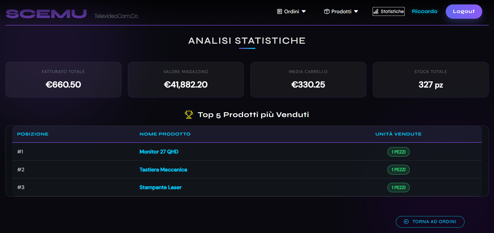
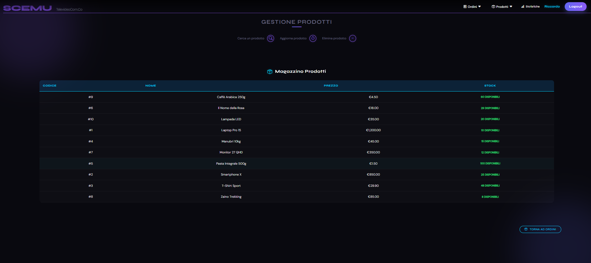
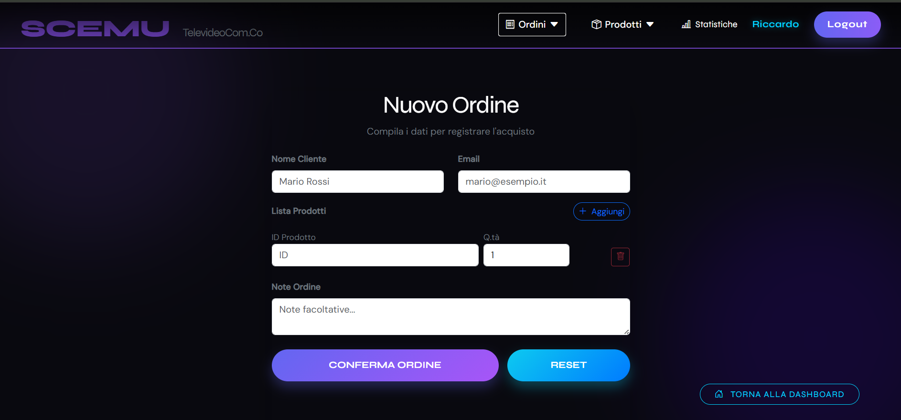

# 🥊 Gestione Magazzino - Scemu - Televideocom . Co
<<<<<<< HEAD

### 📊 Dashboard Analisi e Statistiche

### 📦 Gestione Magazzino e Scorte

### 🛒 Gestione Ordini e Clienti

Questo è un gestionale Full-Stack "Enterprise" progettato per il controllo totale del magazzino, degli ordini e della produzione.
>>>>>>> 99990d52776e49cdf4635a437e6792e07d96dca0

---

## 🏗️ Architettura del Progetto
<<<<<<< HEAD
=======

>>>>>>> 99990d52776e49cdf4635a437e6792e07d96dca0
Il sistema è diviso in due macro-aree principali per garantire scalabilità e pulizia del codice.

### 🐍 Backend (`Scemu_BE`)
Costruito con un'architettura moderna in Python, focalizzata su velocità e sicurezza.
- **Framework:** **FastAPI** per la creazione di API REST rapide e documentate automaticamente.
- **ORM:** **SQLAlchemy** per la gestione del database tramite modelli Python.
- **Validazione Dati:** **Pydantic** per assicurare che ogni dato in ingresso sia corretto prima di essere elaborato.
- **Database:** **MariaDB** (Script disponibile nella cartella `/Database`).
<<<<<<< HEAD
- **Operazioni:** Implementazione completa di rotte **CRUD** per la gestione di ordini, prodotti e utenti.
=======
- **Operazioni:** Implementazione completa di rotte **CRUD** (Create, Read, Update, Delete) per la gestione di ordini, prodotti e utenti.
>>>>>>> 99990d52776e49cdf4635a437e6792e07d96dca0

### 🅰️ Frontend (`Scemu_FE`)
Un'interfaccia reattiva e dinamica che comunica in tempo reale con le API del backend.
- **Framework:** **Angular 17+**.
- **Logica:** Sviluppata in **TypeScript (TS)** per un codice robusto e tipizzato.
<<<<<<< HEAD
- **Struttura:** HTML5 semantico e **CSS3** personalizzato per un'interfaccia moderna e "abbellita".
=======
- **Struttura:** HTML5 semantico e **CSS3** personalizzato per un'interfaccia moderna e "abbellita" per l'utente finale.
- **Comunicazione:** Utilizzo di Angular HttpClient per il consumo delle rotte CRUD del backend.
>>>>>>> 99990d52776e49cdf4635a437e6792e07d96dca0

---

## 💾 Schema del Database
<<<<<<< HEAD
Il database `ordini_base` gestisce le seguenti entità principali:
- **Utenti**, **Prodotti**, **Ordini**, **Righe Ordini**.
=======

Il database `ordini_base` gestisce le seguenti entità principali:
- **Utenti:** Gestione degli accessi al sistema.
- **Prodotti:** Catalogo completo con gestione dello stock e categorie.
- **Ordini:** Tracciamento delle vendite e stato della spedizione.
- **Righe Ordini:** Dettaglio tecnico dei prodotti per ogni singolo ordine.

>>>>>>> 99990d52776e49cdf4635a437e6792e07d96dca0
> 📄 Trovi lo script completo qui: [db.sql](./Database/db.sql)

---

<<<<<<< HEAD
## 🛠️ Technologies Used
- **Python:** Pandas, SQLAlchemy, Pydantic, Uvicorn, PyJWT, FastAPI
- **SQL:** MariaDB
- **Frontend:** Angular, TypeScript, CSS3
- **Version Control:** GitHub

---

## 🚀 Come avviare il progetto

### Backend
1. `cd Scemu_BE`
2. `pip install fastapi sqlalchemy pydantic uvicorn pyjwt pandas`
3. `uvicorn main:app --reload`

### Frontend
1. `cd Scemu_FE`
2. `npm install`
3. `ng serve`

---

## ✍️ Authors
* **Riccardo Lai**
* **Alessio Pilloni**
* **Federico Asunis**
Perché è meglio così?
=======
## 🚀 Come avviare il progetto

### Backend
1. Entra nella cartella: `cd Scemu_BE`
2. Installa le librerie: `pip install fastapi sqlalchemy pydantic uvicorn`
3. Avvia il server: `uvicorn main:app --reload`

### Frontend
1. Entra nella cartella: `cd Scemu_FE`
2. Installa le dipendenze: `npm install`
3. Avvia l'app: `ng serve
>>>>>>> 99990d52776e49cdf4635a437e6792e07d96dca0
